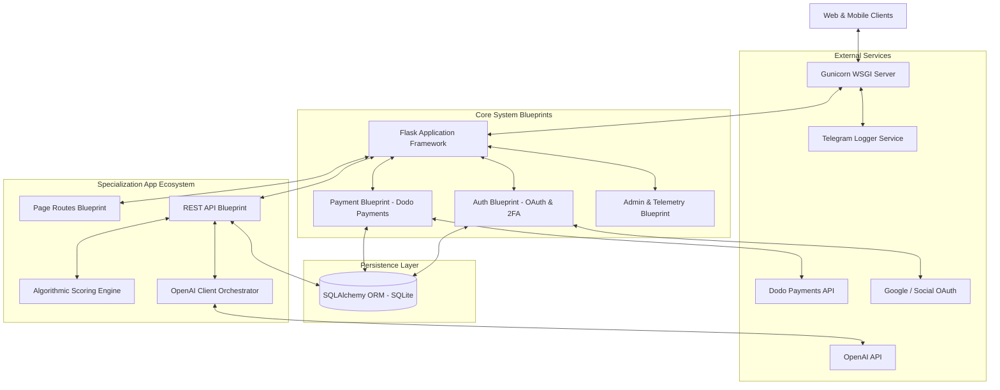

  

  # Thmmd (ثمد) — Technical Documentation

  **A High-Performance Educational & Career Guidance Platform**

  
  
  

 **Visit at [thmmd.com](https://thmmd.com)**

  ---

  ### Main Platform Interface
  
  

---

## 🔒 License & Repository Status

> **Important Notice:** **Thmmd (ثمد)** is a **proprietary, closed-source project**. All underlying source code, database schemas, internal algorithms, and proprietary assets remain strictly confidential and private. This document is provided solely for technical overview and architectural documentation purposes.

## 🚀 Architectural Overview

Thmmd is designed as a modular, multi-tiered web platform that delivers personalized career and educational guidance through interactive assessment pipelines, algorithmic scoring, and AI-driven synthesis engines.

The platform architecture follows Flask's Blueprint pattern, decoupling authentication, payment infrastructure, administrative controls, and specialized recommendation engines into isolated, manageable modules.

## 🛠️ Technology Stack

### 1. Backend Core & Application Server
* **Language & Runtime:** Python 3.11+
* **Web Framework:** Flask `v3.1.1` (Structured via WSGI Application Blueprints)
* **WSGI Production Server:** Gunicorn `v23.0.0`
* **Configuration:** Environment isolation via `python-dotenv`

### 2. Database & Data Persistence
* **Object-Relational Mapping (ORM):** `Flask-SQLAlchemy`
* **Database Engine:** Relational SQLite database with dynamic migration routines
* **Data Domain Models:**
  * User identity & security credentials
  * Specialization session state & assessment metrics
  * Product catalog & verified customer reviews
  * Affiliate code tracking & commission attribution
  * Page visit telemetry & traffic mapping

### 3. Security & Authentication Architecture
* **Federated Identity:** `Authlib` supporting Google OAuth 2.0 workflows
* **Session Management:** `PyJWT` for signed JSON Web Tokens
* **Two-Factor Authentication (2FA):** `pyotp` (Time-based One-Time Password / TOTP) with dynamic QR code generation (`qrcode[pil]`)
* **Input Sanitization:** `bleach` (HTML payload scrubbing) paired with internal input validation utilities (`secure_input_checker`)

### 4. AI & Assessment Scoring Engine
* **AI Orchestrator:** Integration with `openai` Python SDK for structured content generation and career pathway guidance
* **Deterministic Scoring Logic:** Multi-factor algorithmic scoring module (`scoring.py`) evaluating user input responses before handing context to the AI layer
* **Telemetry & Event Observability:** Asynchronous system event logger (`telegram_logger`) delivering operational notifications

### 5. Monetization & E-Commerce Pipeline
* **Payment Processing:** `dodopayments` SDK integration for checkout flows and webhook processing
* **Discount & Attribution Engine:** Dynamic session coupon resolution supporting direct discounts and affiliate code tracking

### 6. Frontend Engine & Design System
* **Markup & Structure:** Semantic HTML5
* **Styling Framework:** Vanilla CSS using CSS Custom Properties (Design Tokens) for adaptive theme management
* **Dual Design Systems:**
  * **Thmmd Core:** Neo-Brutalist aesthetic featuring warm cream surfaces (`#faeed7`), heavy dark outlines (`#1D2B34`), block offset shadows, and high-contrast accent blocks.
  * **Thmmd Specialization:** Schematic product dashboard aesthetic emphasizing soft rounded geometry, pill navigation, step timelines, and focused workspace aesthetics.
* **Typography:** Custom serif font family (`thmanyahseriftext` & `thmanyahserifdisplay`)
* **Client-Side Interactivity:** Vanilla JavaScript utilizing asynchronous Fetch API calls for seamless wizard transitions, real-time reviews, and interactive quiz flows.

## 🏛️ Module Breakdown

### 1. Specialization Engine (`my_specialization`)
The core value-add sub-application powering user assessments:
* **Step-by-Step Guidance Wizard:** Modular frontend & backend flow capturing user educational background and aptitudes.
* **Algorithmic Scoring (`scoring.py`):** Converts assessment answers into multi-dimensional score vectors.
* **AI Generation Layer (`ai.py`):** Combines quantitative scores with qualitative user profiles to generate structured recommendations.

### 2. Authentication & Authorization (`auth`)
* Supports multi-provider login (Local credentials, OAuth single sign-on).
* TOTP-based two-factor authentication for elevated account security.
* Role-based access controls for administrative functionality.

### 3. Payment & Subscription Pipeline (`payment`)
* Secure checkout flow integrated with Dodo Payments API.
* Real-time coupon resolution and affiliate link tracking.

### 4. Analytics & Telemetry (`admin` & `utils`)
* Built-in route traffic tracker (`PAGE_VISIT_MAP`) monitoring user progression across conversion funnels.
* Real-time event notifications sent via automated logger channels.

## 🔐 Security & Engineering Guidelines

* **Defense in Depth:** Input validation occurs at both request boundary levels and database persistence handlers.
* **Secrets Isolation:** Sensitive API tokens, application keys, and database connections are injected exclusively via runtime environment variables.
* **Separation of Concerns:** Business logic, API controllers, database models, and presentation templates are organized in distinct blueprint modules.

## 📄 Terms & License

Copyright © 2026 **Thmmd (ثمد)**. All Rights Reserved.

This codebase and associated assets are **Proprietary and Closed Source**. Unauthorized distribution, reproduction, modification, or reverse engineering of any portion of this system is strictly prohibited.
